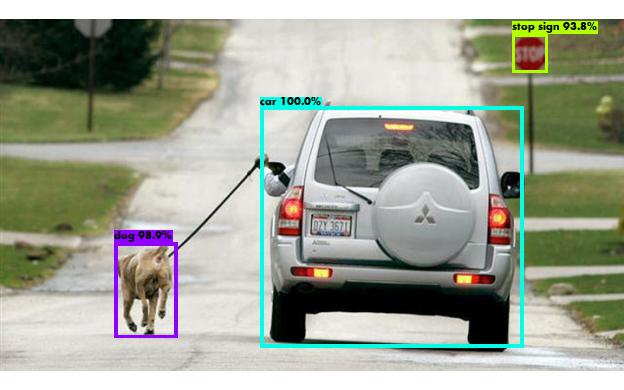
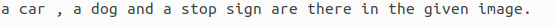

# Y_Stub
This directory is a very basic individual approach to the state of the art object detection algorithm [YOLO](https://pjreddie.com/darknet/yolo/) based image tagger. For more information please refer to  `readme_first.pdf`. For more information about YOLO please  refer [Here](https://github.com/pjreddie/darknet).
## Installation
##### Clone and install requirements

    $ git clone https://github.com/13idyut/Y_Stub.git
    $ cd Y_Stub
    $ pip install -r requirements.txt
##### Download pretrained weights
Download pretrained YOLOv3 weights from [Here](https://pjreddie.com/media/files/yolov3.weights) or just run:

    $ cd Y_Stub
    $ wget https://pjreddie.com/media/files/yolov3.weights
## Inference
Uses pretrained weights to generate stubs from the image. Stubs are stored in `tag.txt`. A paragraph is generated out of the stubs and stored in `answer.txt`. One can customise paragraph template as per their need to generate description out of Y_stub. To see Y_Stub in action just run:

    $ cd Y_Stub
    $ python app.py path/to/image/<image-name.jpg/png>

## Credit
###  YOLOv3: An Incremental Improvement
_Joseph Redmon, Ali Farhadi_

Y_Stub is based on YOLOv3 implemented in TensorFlow. Here
`iou threshold` is set to `0.5` and `confidence threshold` is set to `0.7`. User can tweak vales as per their need.

[[paper]](https://pjreddie.com/media/files/papers/YOLOv3.pdf)[[website]](https://pjreddie.com/darknet/yolo/)[[YOLO]](https://github.com/pjreddie/darknet)
## License
[MIT](https://choosealicense.com/licenses/mit/)
